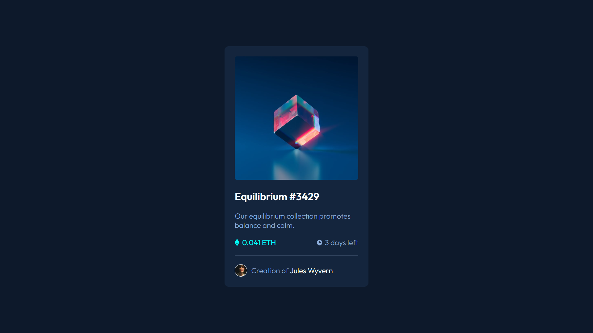

# nft-preview-card-component

Card NFT utilizando HTML e CSS.

## Preview

## Tecnologias

- HTML5
- CSS3

## Informações

- Uso do padrão BEM de CSS

## Link de acesso

<a href="https://udanielnogueira.github.io/nft-preview-card-component/" target="_blank">NFT Card Preview component</a>

## Link do desafio

<a href="https://www.frontendmentor.io/challenges/nft-preview-card-component-SbdUL_w0U" target="_blank">Desafio NFT Card Preview component</a>
